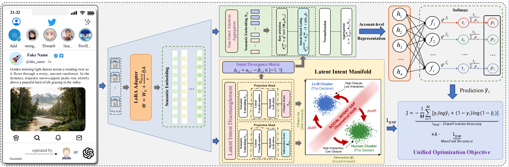

# SIFT: Identifying LLM-driven Bot via Social Intent

[](https://opensource.org/licenses/MIT)
[](https://pytorch.org/)
[](https://anonymous.4open.science/)

## 📰 Abstract

The proliferation of Large Language Models (LLMs) has empowered a new generation of social bots capable of generating high-fidelity content that mimics human discourse, posing severe threats to digital ecosystems through sophisticated disinformation campaigns. Existing detection paradigms are ineffective against the advanced linguistic capabilities and social mimicry of these bots. In this work, we identify a social intent phenomenon: \textit{Humans initiate interaction, while LLMs publish statements.} Human posts are typically interaction-driven (e.g., seeking advice, emotional venting), while LLM-generated posts are informational, neutral, self-contained content that stifles conversation. Motivated by this finding, we propose SIFT, a novel framework designed to detect LLM-driven bots by disentangling social intent from multimodal content. SIFT utilizes a vision-language model adapted to project user timelines onto a latent intent manifold. We introduce a manifold separation loss to enforce structural divergence between human and LLM-driven bots' behaviors. Experiments indicate that SIFT outperforms existing state-of-the-art methods by up to 9.53\%.



## 📰 Introduction

Current bot detection methods struggle against LLMs (e.g., GPT-4, Qwen) because these models generate coherent, grammatically perfect text. **SIFT** solves this by leveraging a fundamental sociological insight:

> **"Humans initiate interaction (Seekers), while LLMs publish statements (Declarers)."**

SIFT projects user timelines onto a latent **Intent Manifold**, defined by two orthogonal axes:

1. **Information Closure ($\alpha$)**: The degree of self-contained, factual completeness (Typical of LLMs).
2. **Social Interaction ($\beta$)**: The degree of emotional signaling and conversational solicitation (Typical of Humans).

By enforcing a **Manifold Separation Loss**, SIFT creates a structural "void" between human and bot representations, making detection robust and explainable.

---

## 🛠️ Framework Architecture

The implementation consists of three main mathematical components mapped to PyTorch modules:

1. **Latent Intent Disentanglement**: Projects embeddings into ($\alpha, \beta$) scores.
2. **Intent-Gated Attention**: A specialized attention mechanism that ignores ambiguous posts and focuses on high-intent signals.
3. **Unified Optimization**: Combines classification loss with manifold structure constraints.

### 📂 Project Structure

```text
SIFT_Project/
│
├── config.py              # [IMPORTANT] Central configuration for all hyperparameters
├── train.py               # Main training entry point
├── dataset.py             # Data loading logic (includes Mock/Simulation mode)
│
├── core/                  # Core mathematical implementations
│   ├── __init__.py
│   ├── losses.py          # Implements Eq. 9 (Manifold Separation Loss)
│   └── layers.py          # Implements Eq. 6-8 & 11-14 (Disentanglement & Gating)
│
└── models/                # Neural Network Architecture
    ├── __init__.py
    ├── backbone.py        # Wrapper for VLM (e.g., Qwen2-VL + LoRA)
    └── sift_model.py      # Assembly of SIFT modules
```

---

## ⚙️ Parameters & Configuration

All parameters are centrally managed in `config.py`. Below are detailed descriptions mapping the code parameters to the paper's mathematical definitions.

### 1. Theoretical Hyperparameters (Paper Section 5 & 6.3)

These parameters control the core "Social Intent" logic.

| Parameter (`config.py`) |    Symbol (Paper)    | Default | Detailed Description                                                                                                                                                                                                                                                                                                                 |
| :------------------------ | :------------------: | :-----: | :----------------------------------------------------------------------------------------------------------------------------------------------------------------------------------------------------------------------------------------------------------------------------------------------------------------------------------- |
| `separation_margin`     |     $\xi$ (xi)     | `0.5` | **Manifold Separation Margin**. Defined in **Eq. 9**. This controls the width of the "ambiguity void". `<br>`• For LLMs, we enforce $\alpha - \beta > \xi$.`<br>`• For Humans, we enforce $\alpha - \beta < -\xi$.`<br>`Larger values force a wider separation between clusters.                             |
| `gamma_scale`           |  $\gamma$ (gamma)  | `1.0` | **Gating Scaling Factor**. Defined in **Eq. 12**. Controls the sensitivity of the attention mechanism.`<br>`• $e^{gated} = e^{raw} \cdot (1 + \gamma \mid\Delta\mid)$`<br>`• Higher $\gamma$ makes the model pay *significantly* more attention to posts with strong intent signals, ignoring neutral posts. |
| `lambda_loss`           | $\lambda$ (lambda) | `0.1` | **Structural Loss Weight**. Defined in **Eq. 16**. Balances the trade-off between:`<br>`1. Accuracy ($\mathcal{L}_{BCE}$)`<br>`2. Intent Structure ($\mathcal{L}_{sep}$).`<br>`Too high $\lambda$ may hurt convergence; too low ignores the intent theory.                                                   |

### 2. Model Architecture Parameters

Parameters defining the neural network size and complexity.

| Parameter         | Default | Description                                                                                                        |
| :---------------- | :------: | :----------------------------------------------------------------------------------------------------------------- |
| `input_dim`     | `1024` | The dimension of raw features coming from the tokenizer or feature extractor (before LoRA adaptation).             |
| `embed_dim`     | `768` | The hidden dimension ($d$) of the backbone encoder output ($h_{i,j}$). Matches the LLM hidden size.            |
| `attention_dim` | `128` | The internal dimension of the query vector$\mathbf{q}$ and projection $W_{att}$ in the Intent-Gated Attention. |
| `num_classes`   |  `1`  | Binary classification output (0 = Human, 1 = LLM-Bot).                                                             |
| `dropout`       | `0.1` | Dropout rate applied before the final classifier head.                                                             |

### 3. Training & Data Parameters

Parameters controlling the optimization process.

| Parameter         | Default | Description                                                                                                                                               |
| :---------------- | :------: | :-------------------------------------------------------------------------------------------------------------------------------------------------------- |
| `seq_len`       |  `20`  | **Sequence Length ($N$)**. The number of historical posts sampled per user. The paper suggests $N=20$ is sufficient to capture intent patterns. |
| `batch_size`    |  `32`  | Number of user timelines per gradient update.                                                                                                             |
| `learning_rate` | `1e-4` | Learning rate for `AdamW` optimizer.                                                                                                                    |
| `num_epochs`    |  `10`  | Total training epochs.                                                                                                                                    |
| `weight_decay`  | `0.01` | L2 regularization factor.                                                                                                                                 |

---

## 🚀 Usage Guide

### 1. Installation

Ensure you have Python 3.8+ and PyTorch installed.

### 1. Installation Guide

1. **Create a Virtual Environment:**

```bash
 conda create -n sift python=3.10
 conda activate sift
```

2. **Install PyTorch (CUDA Version):**
   *Note: It is recommended to install PyTorch strictly following the official guide to match your CUDA version before installing other requirements.*

```bash
 # Example for CUDA 11.8
 pip install torch torchvision --index-url https://download.pytorch.org/whl/cu118
```

3. **Install SIFT Dependencies:**

```bash
 pip install -r requirements.txt
```

4. **Flash Attention (Optional):**
   If you are using Qwen2-VL, installing Flash Attention is highly recommended for speed:

```bash
 pip install flash-attn --no-build-isolation
```

### 2. Quick Start

The repository comes with a `MockSocialDataset` generator so you can run the code immediately to verify the pipeline.

```bash
# Run the training loop with simulated data
python train.py
```

Expected Output:

```text
Running SIFT on device: cuda
Initializing Dataset...
Initializing Model...
Start Training...
Epoch [1/10] Total Loss: 0.7523 | BCE: 0.6912 | Manifold: 0.6110
...
```

### 3. Using Custom Data

To train on your own dataset (e.g., TwiBot-22 or Weibo), modify `dataset.py`:

1. Prepare your data as a list of User objects, where each user has a list of posts.
2. Update `dataset.py` to load your data:

```python
# dataset.py (Example modification)
class RealSocialDataset(Dataset):
    def __init__(self, data_path, seq_len):
        self.data = load_json(data_path) # Your custom loader
        self.seq_len = seq_len

    def __getitem__(self, idx):
        user_data = self.data[idx]
        # 1. Extract features (Text+Image embeddings pre-computed or tokenized)
        features = user_data['post_embeddings'] 
        # 2. Get label
        label = torch.tensor([user_data['label']]) # 0 or 1
        return features, label
```

Then update `train.py` to use `RealSocialDataset`.

---

## 🧠 Code Walkthrough: From Theory to Implementation

This section highlights how specific equations in the paper are translated into code.

### A. The Intent Manifold (Eq. 6-8)

*Located in: `core/layers.py` -> `LatentIntentDisentanglement`*

The paper proposes that every post has an "Information" score ($\alpha$) and "Interaction" score ($\beta$).

```python
# Code snippet
alpha = torch.sigmoid(self.head_alpha(h)) # Eq. 6
beta = torch.sigmoid(self.head_beta(h))   # Eq. 7
delta = alpha - beta                      # Eq. 8 (Intent Divergence)
```

### B. Manifold Separation Loss (Eq. 9)

*Located in: `core/losses.py` -> `SIFTLoss`*

We punish "ambiguity". If a user is a Bot, they *must* have high $\alpha$ and low $\beta$ ($\Delta \to 1$).

```python
# Code snippet (Simplified)
# If Label=1 (Bot), we want delta > xi. 
# Loss is positive if delta < xi.
loss_llm = torch.relu(xi - delta) 

# If Label=0 (Human), we want delta < -xi.
# Loss is positive if delta > -xi.
loss_human = torch.relu(xi + delta)
```

### C. Diagnostic Attention (Eq. 12)

*Located in: `core/layers.py` -> `IntentGatedAttention`*

Normal attention weights are scaled by how "strong" the social intent is.

```python
# Code snippet
# gamma_scale is the hyperparameter
gating_factor = 1.0 + gamma_scale * torch.abs(delta)
e_gated = e_raw * gating_factor
```

---

## 📜 Citation

If you use this code or the SIFT framework in your research, please cite:

```bibtex
@article{SIFT2025,
  title={SIFT: Identifying LLM-driven Bot via Social Intent},
  author={Anonymous Authors},
  journal={Under Review},
  year={2025}
}
```

## ⚠️ Disclaimer

This implementation serves as a reference for the SIFT logic.

* **Backbone:** The `MultimodalBackbone` class provided is a placeholder. For state-of-the-art results (as reported in Table 2 of the paper), you must integrate a real pre-trained Vision-Language Model like **Qwen2-VL** or **LLaVA**.
